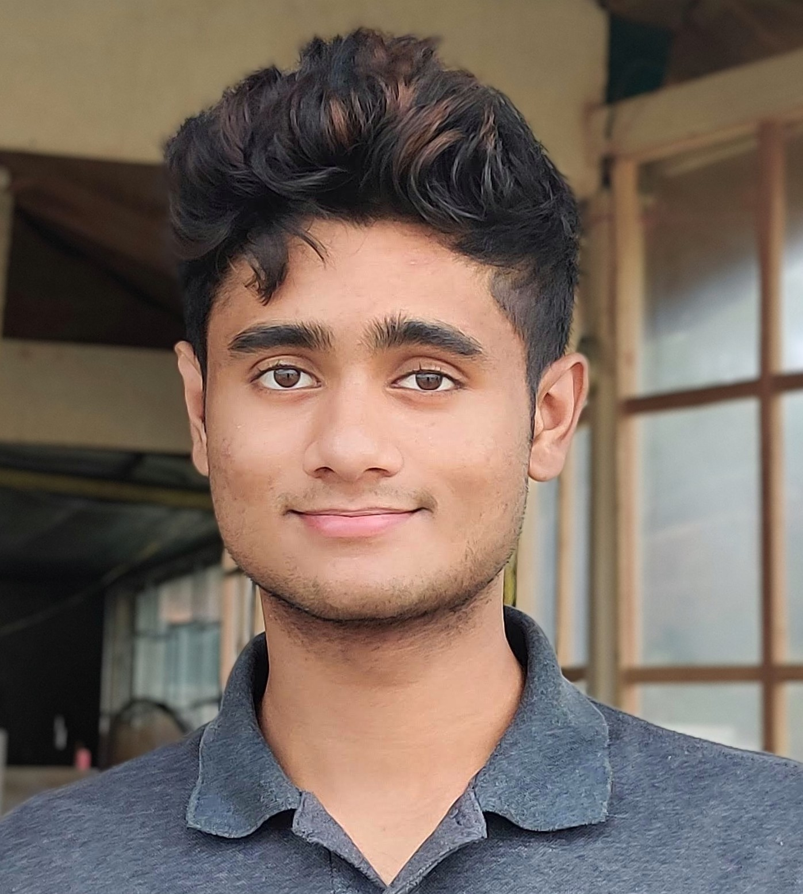

## User Page

My name is Advaith Ravishankar. I am *_Math+CS and Cognitive Science Double Major_*. Below is my profile picture for this class:



> This is my CSE110 lab1 demo

## Table of contents
1. [User Page](#user-page)
2. [Table of contents](#table-of-contents)
3. [Demo of Code](#demo-of-code)
4. [Programming langauges I know](#programming-langauges-i-know)
5. [Creating this repository](#creeating-this-repository)
6. [List of tasks for this assigments](#list-of-tasks-for-this-assigments)

## Demo of Code
Here is a quick demo of python code

```python
def hello(name):
    print(f'hello, {name}. Welcome to my user page!')
```

### Programming langauges I know
- Python
- Java
- C++
- C
- JavaScipt
- ARM
- Matlab
- R

My favorite search engine is  [Google](https://www.google.com/)

## Creating this repository
1. to create this reposiory look at [Create Repo and switch branch](screenshots/Create_repo_and_switch_branch.png)
2. to add branched readme file look at [update readme file](screenshots/Update_readme_file.png)
3. to see how I added the private.txt file look at [private](screenshots/Added_private_and_gitignore.png)

### List of tasks for this assigments
- [x] ###### Headings
- [x] **sttling quotes**
- [x] Quoting text
- [x] Quoting code
- [x] external linkes
- [x] section links
- [x] relative links
- [x] ordered and unorder lists
- [x] task list


